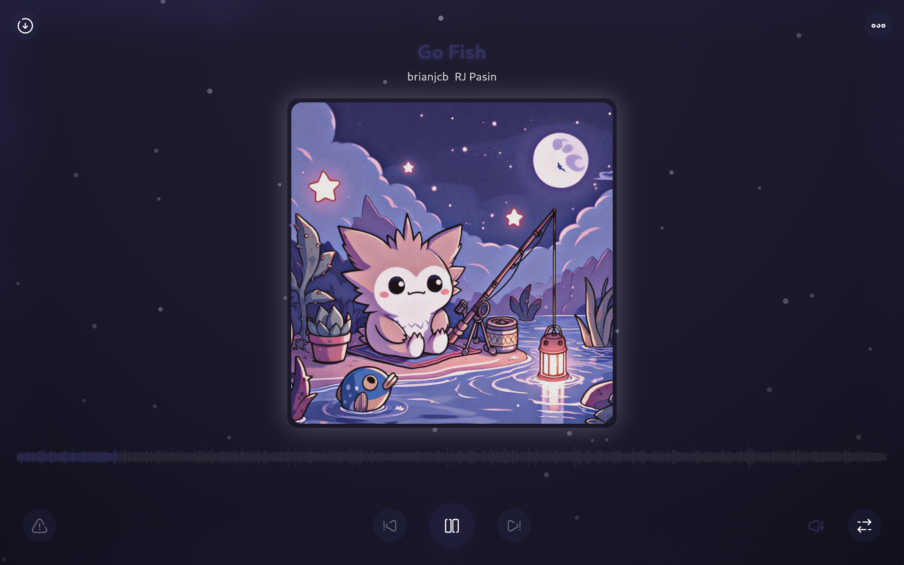

    
    Adiman

A flutter music player app I made for linux using [flutter_rust_bridge](https://github.com/fzyzcjy/flutter_rust_bridge) for efficency (as I can't code well) inspired by [namida](https://github.com/namidaco/namida) as you will have seen by the obvious fact that the name is just namida backwards.

# Dependencies (These apply even when not building)

- Ffmpeg
- Spotdl (via python if you want downloading songs to work)

# Installing

(There are only linux builds currently) Head over to [releases](https://github.com/ChaosTheChaotic/Adiman/releases/latest), download the appimage for your architecture, mark executable (if needed) and run the appimage

# Features

- Can play music (duh)
- Adaptive ui
- Playlists
- Downloading songs via spotdl command line (this takes a while due to all the rate limits so unfortunately you just have to wait it out)
- Waveform seekbar
- Lyrics from online source ([lrclib](https://lrclib.net/))
- Shuffle option (mostly untested due to me not using it that often)
- Mpris support
- Shuffling
- Sorting searching
- Artist separators (Also untested due to me not using it that often)
- Caching
- Choosable music folder
- Horribly inefficent code

# Screenshots

  
  
  
  
  

# Building
To build you must have [flutter_rust_bridge](https://github.com/fzyzcjy/flutter_rust_bridge) installed, (obviously) the flutter sdk and rust (obviously). To generate the dart to go with the rust you should run `flutter_rust_bridge_codegen generate` and to build the rust you must run `flutter build linux`.
