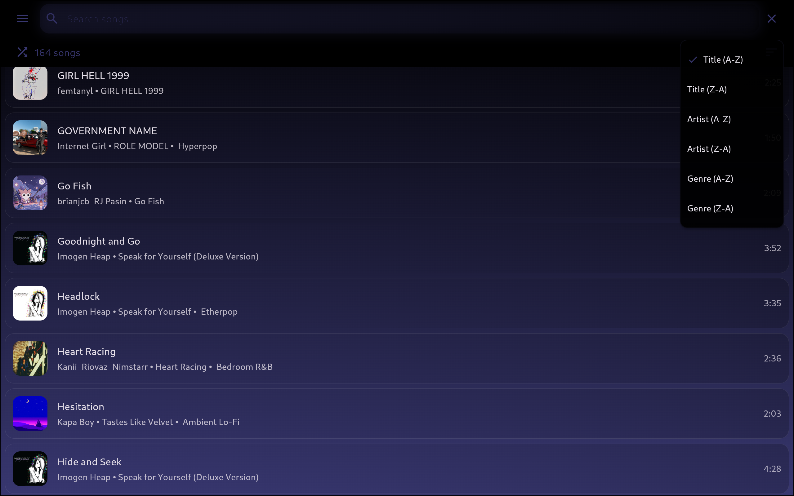
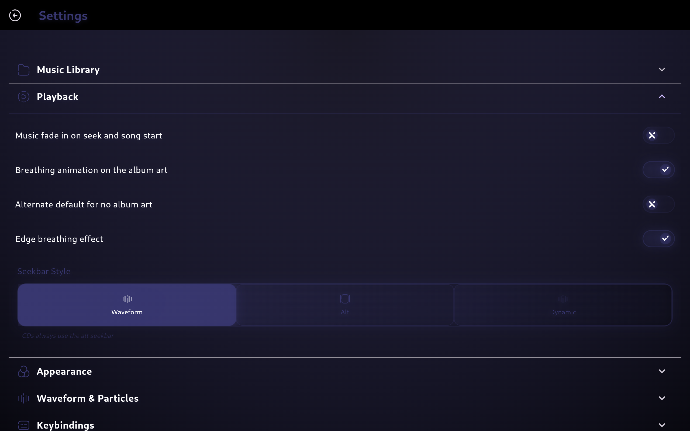

<div style="
    background: linear-gradient(145deg, #ffffff0d 0%, #ffffff05 100%);
    padding: 12px 24px;
    border-radius: 12px;
    margin: 20px auto;
    display: inline-flex;
    align-items: center;
    gap: 20px;
    box-shadow: 0 4px 6px -1px rgba(0, 0, 0, 0.1);
    border: 1px solid #ffffff15;
    backdrop-filter: blur(8px);
    transition: transform 0.2s ease;
">
    
    <h1 style="
        margin: 0;
        font-size: 2.5rem;
        font-weight: 600;
        background: linear-gradient(45deg, #fff 0%, #a0aec0 100%);
        -webkit-background-clip: text;
        background-clip: text;
        color: transparent;
        text-shadow: 0 2px 4px rgba(0,0,0,0.1);
    ">Adiman</h1>
</div>

<a href="https://github.com/flutter/flutter"></a>
<a href="https://github.com/fzyzcjy/flutter_rust_bridge"></a>
<a href="https://ghloc.vercel.app/ChaosTheChaotic/Adiman?branch=main"></a>

A flutter music player app I made for linux using [flutter_rust_bridge](https://github.com/fzyzcjy/flutter_rust_bridge) for efficency (as I can't code well) inspired by [namida](https://github.com/namidaco/namida) as you will have seen by the obvious fact that the name is just namida backwards.

# Dependencies (These apply even when not building)

- Ffmpeg
- Spotdl (via python if you want downloading songs to work)

# Installing

(There are only linux builds currently) Head over to [releases](https://github.com/ChaosTheChaotic/Adiman/releases/latest) (or download from artifacts if your architecture isnt there yet), download the appimage for your architecture, mark executable (if needed) and run the appimage

# Features

- Can play music (duh)
- Adaptive ui
- Smooth animations
- Playlists
- Downloading songs via spotdl command line (this takes a while due to all the rate limits so unfortunately you just have to wait it out)
- Waveform seekbar
- Lyrics from online source ([lrclib](https://lrclib.net/))
- Shuffle option (mostly untested due to me not using it that often)
- Mpris support
- Shuffling
- Sorting searching
- Artist separators (Also untested due to me not using it that often)
- Caching
- Choosable music folder
- In-app volume slider
- Customisable
- CD Support
- Auto conversion of non-mp3 songs via ffmpeg (if you have many of these files you might have to wait a bit before reloading the library)
- Horribly inefficent code

# Screenshots

<div style="display: grid; grid-template-columns: repeat(auto-fit, minmax(300px, 1fr)); gap: 20px; margin-top: 20px;">
  
  
  
  
  
  
</div>

# Building
## Preqrequisites
- Flutter
- flutter_rust_bridge_codegen (installed via cargo)
- cdparanoia (this is required for my cd_audio library to build as it uses cdda_interface.h)
- libcdio
- libcdio_cdda
- git
- GTK
- rustup
- Working rust
## Build steps
1. Git clone the repo and go into the directory
```
git clone "https://github.com/ChaosTheChaotic/Adiman.git" && cd Adiman
```
2. Run the build commands
```
flutter_rust_bridge_codegen generate && flutter build linux --release
```
3. The app should be done and you can now run it
```
build/linux/<your_architecture>/release/bundle/adiman
```

# Helpful people
- MSOB7Y (the creator of namida) for the inspiration and motivation for this and where I got the icons from
- DuckTheCrowolf (thevietnamesecrow on discord) for making the logo
